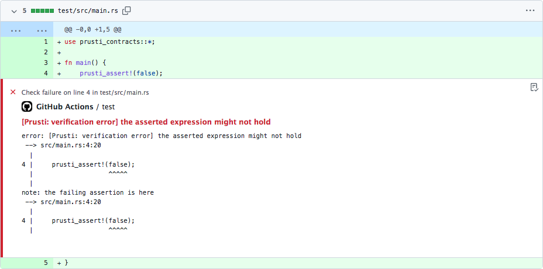

# Verify with Prusti

This action verifies Rust code using the [Prusti verifier](https://github.com/viperproject/prusti-dev). It supports verification of crates and individual Rust files.

## Inputs

## `path`

**Required**

Path to crate or file to be verified. Note: when using as part of a GitHub workflow, you likely want to [checkout](https://github.com/actions/checkout) the current repository first.

## `version`

Prusti version to use, or `nightly`. Should be the name of a [Prusti release](https://github.com/viperproject/prusti-dev/releases). When set to `"nightly"`, will resolve to the latest available release, including nightly builds.

Default: `"nightly"`

## `verify-crate`

When set to `true`, will verify a full crate. When set to `false`, will verify a single Rust file.

Default: `true`

## `annotation-path`

Relative path from the root of the repository to `path`. Used to correctly attach GitHub annotations.

Default: `""`

## `token`

GitHub token or personal access token. Used only when querying the GitHub API for the latest Prusti release.

Default: `""`
